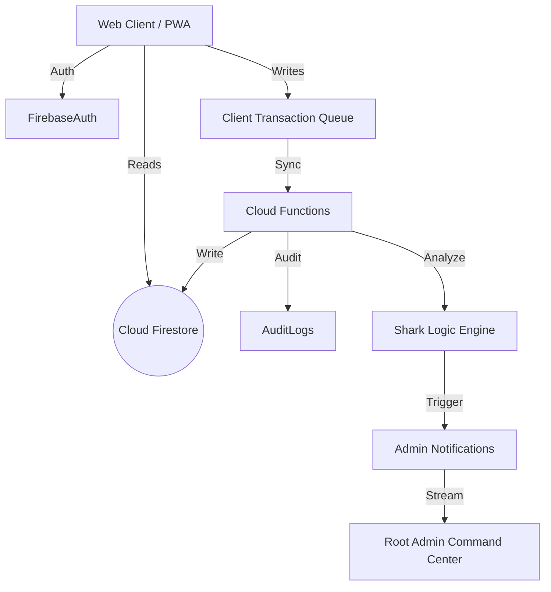

# MASTER TECHNICAL REPORT: Ocean Pearl Ops V2 (Phase 9)
**Date:** 2026-01-03
**Status:** PRODUCTION LIVE
**Version:** Phase 9 (Root Admin & Shark AI Integration)
**Live URL:** [https://oceanpearl-ops.web.app/](https://oceanpearl-ops.web.app/)

## 1. Executive Summary
Ocean Pearl Ops V2 is a cloud-native, offline-first Enterprise Resource Planning (ERP) system designed for distributed seafood supply chain operations in Indonesia. 
The system has reached **Phase 9 Maturity**, effectively enabling "Root Admin" (God Mode) visibility and control. It integrates real-time financial tracking, AI-driven anomaly detection (Shark AI), and granular user provisioning into a single cohesive platform.

**Key Achievements in Phase 9:**
*   **Universal Visibility:** "Context Switching" allows Root Admins to audit remote sites (e.g., Kaimana, Tual) as if they were physically present.
*   **Shark AI Insights:** A background logic layer that continuously monitors transaction streams for yield anomalies (e.g., low recovery rates in cold storage processing) and pushes real-time alerts.
*   **Resilience:** Full offline support for remote operational sites using a persistent transaction queue.

---

## 2. Technical Architecture

### 2.1 Technology Stack
*   **Frontend Framework:** React 18 + Vite 4 (SPA Architecture).
*   **Styling:** Tailwind CSS (Utility-first, responsive mobile-first design).
*   **State Management:** React Context API + Custom Hooks (`useAuth`, `useTransactionQueue`).
*   **Backend / Serverless:** Firebase Cloud Functions (Node.js 20).
*   **Database:** Cloud Firestore (NoSQL, Multi-region replication).
*   **Identity:** Firebase Authentication (Custom Claims for RBAC).
*   **Hosting:** Firebase Global CDN.

### 2.2 System Diagram

---

## 3. Core Modules & Capabilities

### 3.1 The "Command Center" (Root Admin Dashboard)
A specialized view for high-level executives (`ROOT_ADMIN` role).
*   **Global Liquidity Widget:** Aggregates real-time cash balances from all site wallets (`site_wallets` collection) to provide an instant "Cash on Hand" metric.
*   **Shark AI Feed:** A WebSocket-like stream (Firestore `onSnapshot`) of system alerts, including login events, yield warnings, and high-value transactions.
*   **Map/Node Status:** operational status of all registered facilities (Kaimana, Saumlaki, Tual).

### 3.2 Universal Context Bar
A persistent UI component that creates a rigorous security context for every action.
*   **Context Identity:** Displays the active user and their explicit role (e.g., "👤 Tariq (ROOT ADMIN)").
*   **Teleportation (View Switching):** Allows Root Admins to toggle their dashboard context between different physical locations without relogging. This enables remote auditing of "Received vs. Expensed" data for specific units.

### 3.3 Offline Transaction Queue
To support remote islands with unstable internet (VSAT/4G):
*   **Optimistic UI:** Users can submit Recieving/Expense forms while offline.
*   **Persistence:** Data is serialized to `localStorage`.
*   **Synchronization:** A background worker detects connectivity restoration and flushes the queue to the `postTransaction` Cloud Function sequentially.

### 3.4 Shark AI Insights
The intelligence layer embedded in the `auditTransaction` Cloud Function.
*   **Logic:** Upon every `COLD_STORAGE_IN` event (Processing), it calculates **Yield Efficiency** (Output / Input).
*   **Thresholds:**
    *   Yield < 30% = **CRITICAL ALERT** (Red)
    *   Yield < 45% = **WARNING** (Yellow)
*   **Action:** Triggers an immutable record in `admin_notifications` which instantly pops up on the Root Admin Dashboard.

---

## 4. Data Security & Schema

### 4.1 Firestore Schema
The database is structured for scale and security:
*   `users/{uid}`: Profiles, roles, and location assignments.
*   `transactions/{txnId}`: The immutable ledger of all operational events.
*   `site_wallets/{unitId}`: Aggregated cash balances (Read-optimized).
*   `inventory/{unitId}`: Current stock levels (Read-optimized).
*   `admin_notifications/{id}`: Ephemeral alerts for the dashboard.
*   `audit_logs/{id}`: Security/System level logs.

### 4.2 Security Model (RBAC)
*   **Root Admin:** Full read/write access + Context Switching.
*   **Site User:** Scoped strictly to their assigned `locationId`. Can only Write `transactions`. Cannot Edit/Delete.
*   **Viewer:** Read-Only access to Reports.

---

## 5. Deployment & Setup

### 5.1 Production Environment
*   **URL:** `https://oceanpearl-ops.web.app/`
*   **Region:** `asia-southeast2` (Jakarta) for low latency.

### 5.2 Access Credentials (Test Suite)
*Note: Ensure these users are seeded in Firebase Authentication.*

| Role | Email | Password | Access Scope |
| :--- | :--- | :--- | :--- |
| **Root Admin** | `info@oceanpearlseafood.com` | `Test123456!` | Global Control, Dashboard V1 |
| **Site Admin** | `kaimana_admin@ops.com` | `Test123456!` | Location Management |
| **Operator** | `worker_01@ops.com` | `Test123456!` | Receiving, Expenses |

---

## 6. Recommendations for Advisors
1.  **Security Audit:** Review `firestore.rules`. Currently relaxed for Phase 9 debugging; needs tightening for Phase 10.
2.  **Performance:** The `DashboardV1` uses client-side aggregation for stats. As data grows >10k records, migrate this to a scheduled Cloud Function (Aggregator).
3.  **Shark Expansion:** The AI logic currently uses static thresholds. Future phases should implement ML models based on historical species data.

---
**Report Generated By:** Antigravity (Agent)
**For:** Ocean Pearl Seafood Management Board
